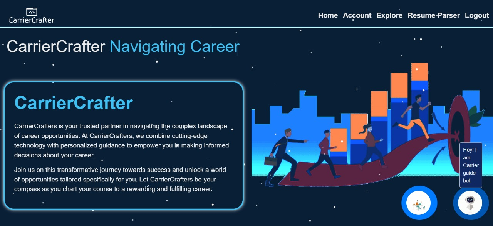
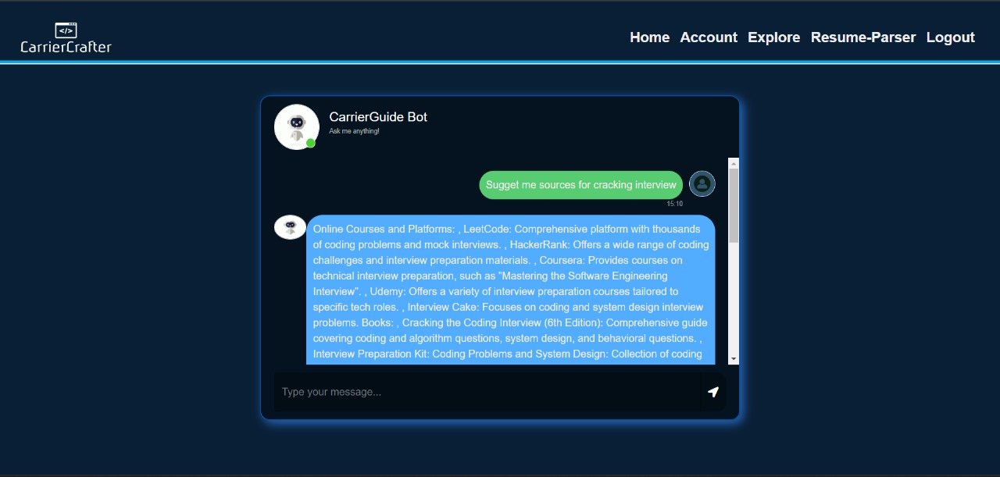
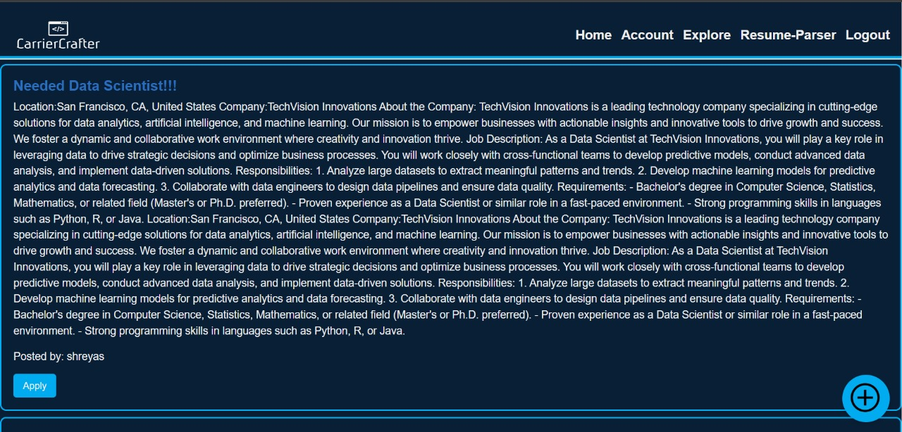
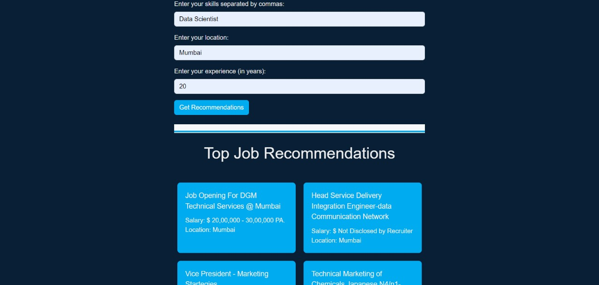

# CarrerCrafter

CareerCrafter, is a cutting-edge web application designed to revolutionize career development and recruitment processes. It leverages a combination of frontend technologies such as HTML, CSS, and JavaScript, and backend technologies including Flask, Python, and SQLite. 

## Features

- Resume Parser: Ensures accurate data processing and efficient candidate evaluation.
- Job Recommendation System: Facilitates effective job matching for candidates and employers.
- Career Guidance Bot: Acts as a virtual mentor for career planning and development.Also provides useful resources,courses,certifications for cracking company's interview.
- Resume Ranker AI  Model: Optimizes the hiring process by efficiently ranking resumes and filtering top candidates.

## Problem it Solves
CareerCrafter aims to tackle the difficulties faced by job seekers and recruiters in today's job market. It simplifies the job search process for job seekers by analyzing resumes accurately, suggesting personalized job opportunities, and offering valuable career advice. On the other hand, it streamlines the talent acquisition process for recruiters by efficiently ranking resumes and identifying top candidates. In summary, CareerCrafter bridges the gap between talent and opportunity, making it effortless for individuals to find suitable jobs and for organizations to discover the right talent.

## ScreenShots

## Conclusion

In conclusion, CarrierCrafter represents a comprehensive and innovative solution for modern career development and recruitment processes. By integrating advanced technologies such as machine learning, AI bots, and resume parsing algorithms, CarrierCrafter empowers individuals to navigate their careers effectively and supports HR departments in talent acquisition, skill development, and strategic planning.

The Resume Parser streamlines candidate evaluation, the Job Recommendation System provides personalized job suggestions, the Google Gemini-Powered Career Guidance Bot offers tailored career advice, and Learngenie recommends relevant courses and learning content. Additionally, the Resume Ranker feature assists recruiters in efficiently filtering and selecting top candidates based on predictive scores.

Overall, CarrierCrafter enhances the efficiency, accuracy, and effectiveness of career advancement and recruitment activities, making it a valuable asset for both job seekers and employers in today's dynamic job market
